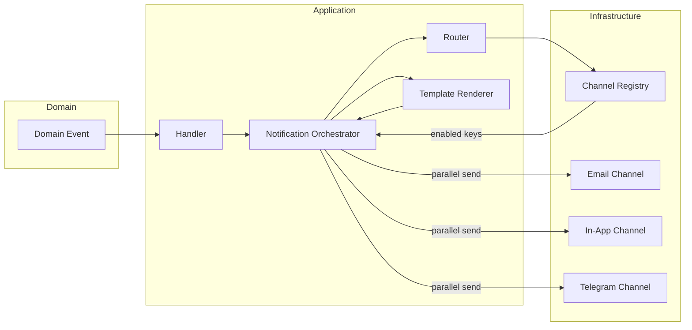
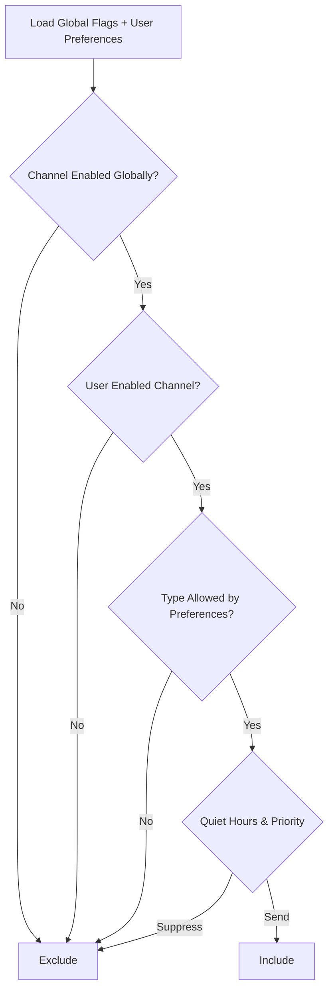
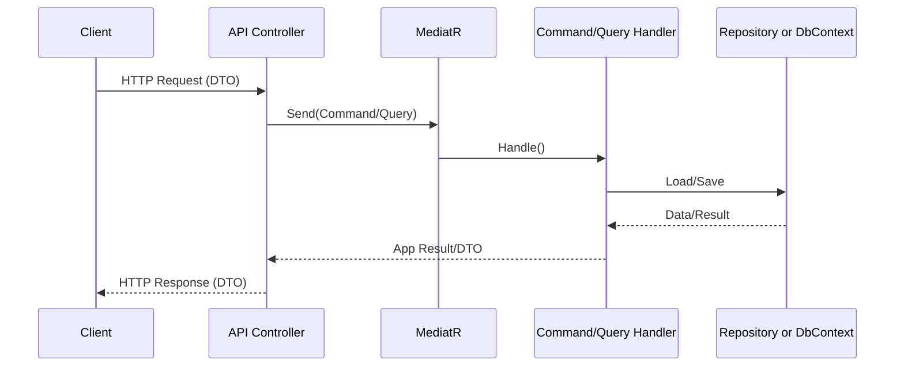

# Backend Architecture and Decisions

This document captures design decisions for Fridgr’s backend and will evolve as the project progresses.

## Overview

- Platform: .NET 8 (C#), EF Core (Npgsql) on PostgreSQL 15
- Architecture: DDD + CQRS in a modular monolith
- Real-time: SignalR (Redis backplane-ready)
- IDs: GUID (agreed)
- Versioning: Route-based `/api/v1`
- Logging: Serilog (console in dev)
- Validation/Mediator: FluentValidation + MediatR + pipeline behaviors

## Solution Structure (planned)

```
backend/
  src/
    BuildingBlocks/
      Fridgr.BuildingBlocks.Domain/           # Entity, ValueObject, DomainEvent, Result
      Fridgr.BuildingBlocks.Application/      # Abstractions, pipeline behaviors, common types
      Fridgr.BuildingBlocks.Infrastructure/   # Common infra helpers (EF base, outbox primitives)

    Modules/
      Identity/
        Fridgr.Identity.Domain/
        Fridgr.Identity.Application/
        Fridgr.Identity.Infrastructure/       # DbContext (schema: identity), EF configs, auth providers
      Households/
        Fridgr.Households.Domain/
        Fridgr.Households.Application/
        Fridgr.Households.Infrastructure/     # DbContext (schema: households)
      Inventory/
        Fridgr.Inventory.Domain/
        Fridgr.Inventory.Application/
        Fridgr.Inventory.Infrastructure/      # DbContext (schema: inventory)
      ShoppingLists/
        Fridgr.ShoppingLists.Domain/
        Fridgr.ShoppingLists.Application/
        Fridgr.ShoppingLists.Infrastructure/  # DbContext (schema: shopping)
      Notifications/
        Fridgr.Notifications.Domain/
        Fridgr.Notifications.Application/
        Fridgr.Notifications.Infrastructure/  # DbContext (schema: notifications) if needed

    Fridgr.Infrastructure/                    # Cross-cutting concrete infra (Serilog, Redis, Email, JWT, OTEL)
    Fridgr.Api/                               # Composition root, endpoints, Swagger, health checks

  tests/
    Fridgr.*.Tests/                           # Unit and integration tests per module
```

Notes:
- Separate database schemas per module (identity, households, inventory, shopping, notifications).
- DbContext-per-module to enforce boundaries; one shared PostgreSQL database.
- Vertical slice folders per feature inside each `*.Application` (see CQRS & Features).

## Building Blocks (shared, technical-only)

- Domain: base `Entity`, `ValueObject`, `DomainEvent`, `IAggregateRoot`, and `Result` types.
- Application: `ICurrentUser`, `IDateTimeProvider`, pagination primitives, MediatR pipeline behaviors (validation, logging, transactions for commands).
- Infrastructure: EF Core helpers (base DbContext abstractions), outbox primitives (optional to adopt early or later).
- No business logic resides here.

## DTO Policy

- API DTOs: Yes. Request/response contracts live close to the API (or per-module `Contracts`), are versioned, and stable.
- Domain: Rich entities/value objects; no API or persistence concerns.
- Persistence: Default is mapping EF Core directly to domain entities via `IEntityTypeConfiguration<T>` and value converters. Introduce persistence-specific DTOs only when necessary (legacy schema, special projections). Keep such types internal to Infrastructure with dedicated mappers.
- Queries: For CQRS read paths, project directly to query DTOs for performance.

## Mapping

- Custom, per-feature mappers (no AutoMapper). Keep small `Mappings` classes or static extension methods near the feature.

## CQRS & Features

- Use MediatR with Commands (writes) and Queries (reads).
- Pipeline behaviors: validation, logging/tracing, and transactional unit-of-work for commands.
- Feature folders inside each `*.Application`:
  - Example: `Features/CreateItem/{CreateItemCommand.cs, Handler.cs, Dto.cs, Mappings.cs, Validator.cs}`

## Infrastructure Layout

- Per-module infrastructure projects: own DbContext, EF configurations, repositories, and outbound adapters used by the module.
- Shared `Fridgr.Infrastructure`: cross-cutting providers (Serilog, JWT issuance, Redis, Email/SMTP, OpenTelemetry, Rate Limiter, Outbox processor).
- `Fridgr.Api` composes all modules and shared infra via DI.

## API Versioning & Routing

- Base path `/api/v1` with endpoint groups per module.
- Controllers (chosen): Use ASP.NET Core Controllers for clearer Swagger and discoverability.

## Security Plan

- Auth: JWT access tokens and refresh tokens with rotation. Roles: Admin, Member, Viewer.
- Token lifetime (contract alignment): API-spec defines 15-minute access tokens and 7-day refresh. SRS currently says 24-hour access. Decision: adopt API-spec (15 min) for MVP and propose updating SRS to match. Longer-lived tokens can be feature-flagged later.
- Development phase for mocks:
  - Option A (fastest): Allow anonymous for mock endpoints, return realistic shapes.
  - Option B: Add a lightweight dev-only auth stub (fixed bearer token) to validate frontend flows without full identity.
- Decision: Start with Option A for speed; add Option B once basic endpoints are in place.

## Configuration & Env Vars

- Connection strings: `ConnectionStrings__DefaultConnection`, `ConnectionStrings__Redis`
- JWT: `Jwt__Issuer`, `Jwt__Audience`, `Jwt__Secret`, `Jwt__AccessTokenMinutes`, `Jwt__RefreshTokenDays`
- CORS: `Cors__AllowedOrigins` (comma-separated)
- API: `Api__DefaultPageSize`, `Api__MaxPageSize`, `Api__EnableSwagger`
- Logging: Serilog minimum level and sinks
- Telemetry: `OTEL_EXPORTER_OTLP_ENDPOINT`, `OTEL_SERVICE_NAME`
- Email/Telegram: `Email__SmtpHost`, `Email__Port`, `Email__Username`, `Email__Password`, `Email__From`, `Telegram__BotToken`

## Contract Stability Strategy (for mock-first)

- Freeze request/response DTOs early by documenting them and exposing Swagger. Treat DTO changes as “contract changes” requiring explicit review.
- Generate OpenAPI from annotations and keep it committed. Frontend can consume the spec.
- Provide mock controllers that return deterministic but realistic payloads aligned with the ICD used in the frontend tests (e.g., `/auth/login`, `/households`, `/inventory`, `/notifications/settings`, `/households/{id}/shopping-lists`).
- Add a `MockMode` option to centralize mock data in one place for consistent behavior while real implementations are built.

### Alignment with SRS and ICD

- Sources reviewed:
  - `.pm/system/mvp/SRS.md` (MVP functional & non-functional requirements)
  - `.pm/system/common/ICD.md` (REST endpoints, DTOs, error format, headers)
  - `.pm/api-specifications.md` (endpoint shapes and examples)
- Routing and scopes:
  - All inventory endpoints are household-scoped as per ICD: `/api/v1/households/{householdId}/items[...]`.
  - Authentication under `/api/v1/auth/*`.
  - Notifications under `/api/v1/notifications/*`.
  - Shopping lists under `/api/v1/households/{householdId}/shopping-lists[...]`.
- Headers and versioning:
  - Support `X-API-Version` and `X-Request-Id` (trace id), and optional `X-Household-Id` where route doesn’t include it.
- Error contract: Standard error envelope from ICD will be implemented for mocks as well.
- Concurrency: PATCH/PUT endpoints will accept `If-Match` and return `ETag` per `.pm/concurrency-control.md`. For mocks, static ETags will be returned to validate client behavior.

## Initial Endpoint Targets (for frontend unblock)

- `POST /api/v1/auth/register` → 201 mock user + tokens
- `POST /api/v1/auth/login` → 200 tokens; error shapes for invalid credentials
- `POST /api/v1/auth/refresh` → 200 new tokens; 401 for invalid/expired
- `GET /api/v1/households` → list households
- `GET /api/v1/households/{id}` → household detail
- `POST /api/v1/households/switch` → 204
- Inventory (household-scoped):
  - `GET /api/v1/households/{householdId}/items` → list with filters/paging/summary
  - `POST /api/v1/households/{householdId}/items` → create
  - `GET /api/v1/households/{householdId}/items/{itemId}` → detail
  - `PATCH /api/v1/households/{householdId}/items/{itemId}` → partial update (ETag)
  - `PUT /api/v1/households/{householdId}/items/{itemId}` → replace (ETag)
  - `DELETE /api/v1/households/{householdId}/items/{itemId}` → delete
  - `POST /api/v1/households/{householdId}/items/{itemId}/consume` → consume
  - `POST /api/v1/households/{householdId}/items/{itemId}/waste` → waste
  - `POST /api/v1/households/{householdId}/items/{itemId}/move` → move location
- `GET /api/v1/notifications/settings` / `PUT /api/v1/notifications/settings`
- Shopping lists: list/create/update items under `/api/v1/households/{id}/shopping-lists`

## Cloud-Agnostic Path (keep future in mind)

- Abstraction-first: Define interfaces in Application for external services (email, cache, message bus, storage, telemetry). Implement in `Fridgr.Infrastructure` with adapters that can be swapped per environment.
- Deployment: Containerized with Docker; no provider-specific SDKs in core code. Later, add IaC modules (Terraform/Bicep) per cloud without changing application code.
- Observability: Use OpenTelemetry for tracing/metrics/logs, export via OTLP to any backend (Jaeger, Grafana, Cloud-native APM) when we enable it post-MVP.
- Messaging (future): Define `IEventBus` and `IOutbox` in Application; default to in-process or noop in MVP, add RabbitMQ/Azure Service Bus/SQS adapters later via MassTransit.
- Storage (future): If file/blob storage is needed, define `IBlobStorage` abstraction; MVP can use local disk or noop; later plug S3/Azure Blob/GCS.
- Configuration: Keep env-driven configuration with clear defaults; avoid hard-coding provider-specific settings.

## MVP Scope Notes

- Notifications Architecture

### Goals

- Allow users to enable/disable channels (Email, In-App, Telegram) without code changes.
- Keep the system cloud-agnostic and testable; add reliability features post‑MVP.

### Design Pattern

- Strategy + Registry: Each channel implements `INotificationChannel` and is discovered via DI.
- Policy-based Router: `INotificationRouter` selects channels using user preferences, message type, and global feature flags.
- Orchestrator (CQRS): `SendNotificationCommand` handled by an orchestrator that routes, renders templates, and dispatches.
- Decorators: Optional wrappers for retry, rate limit, dedup, metrics, and audit logging.
- Outbox (later): Persist `NotificationRequested` and dispatch via background worker for reliability.

### Interfaces (Application)

- `INotificationChannel { string Key; Task<ChannelResult> SendAsync(NotificationEnvelope, CancellationToken) }`
- `INotificationChannelRegistry { IEnumerable<INotificationChannel> All(); INotificationChannel? Get(string key); }`
- `INotificationRouter { IEnumerable<string> Select(UserId, NotificationType, NotificationPreferences, NotificationContext) }`
- `INotificationTemplateRenderer { RenderedMessage Render(string type, object payload, string locale) }`
- `INotificationPreferencesReader { Task<NotificationPreferences> GetAsync(UserId, CancellationToken) }`

### Configuration

- Global (env/appsettings):
  - `Notifications__Channels__Email__Enabled=true|false`
  - `Notifications__Channels__InApp__Enabled=true|false`
  - `Notifications__Channels__Telegram__Enabled=true|false`
  - `Notifications__Retry__MaxAttempts=3`
  - `Notifications__RateLimit__PerMinute=60`
- Per-user (DB): Notification settings document with channel toggles and preferences:
  - `email.enabled`, `inApp.enabled`, `telegram.enabled`
  - `preferences.expirationWarningDays`, `notificationTypes[]`, `preferredTime`, `timezone`, `quietHours`

### MVP vs Post-MVP

- MVP (implement now):
  - In-App notifications (list/history) and Email channel with simple SMTP adapter.
  - Telegram link/unlink endpoint stub; optionally no-op send.
  - Preferences CRUD endpoints (`GET/PUT /api/v1/notifications/settings`), persisted per user.
  - Orchestrator + Router + Channel strategies (without outbox), send inline.
  - Config-driven global enable/disable using `IOptionsMonitor` (hot reload friendly).
- Post-MVP (add later):
  - Outbox + background dispatcher for reliability and retries.
  - Message bus with MassTransit (RabbitMQ first) to decouple send and scale channel workers.
  - Channel decorators (retry policies with Polly, rate limiting, deduplication, metrics, audit logging).
  - Provider-specific adapters (SES/SendGrid, Telegram webhook hosting) without touching Application layer.

### Mermaid: Notifications Flow



### Mermaid: Channel Selection Logic



## Mermaid: Overall Backend Architecture

```mermaid
flowchart LR
    subgraph API[Fridgr.Api]
        SW[Swagger, CORS, Versioning]
        CTRL[Controllers and Endpoint Groups]
    end
    subgraph APP[Application]
        MED[MediatR CQRS]
        VAL[FluentValidation]
        UOW[Transaction Behavior]
        ABS[Abstractions and Ports]
    end
    subgraph DOM[Domain]
        ENT[Entities]
        VO[Value Objects]
        EV[Domain Events]
    end
    subgraph MODS[Modules]
        IDA[Identity]
        HHD[Households]
        INV[Inventory]
        SLP[ShoppingLists]
        NOT[Notifications]
    end
    subgraph INFRA[Infrastructure]
        DB[(PostgreSQL)]
        RED[(Redis)]
        LOG[Serilog]
        EMAIL[Email Adapter]
        TGL[Telegram Adapter]
        BUS[MassTransit (post-MVP)]
    end
    API --> APP --> DOM
    CTRL --> MED
    APP --> MODS
    MODS --> INFRA
    INFRA --> DB
    INFRA --> RED
    INFRA --> LOG
    INFRA --> EMAIL
    INFRA --> TGL
    INFRA --> BUS
```

## Mermaid: Request Handling (CQRS)



- Implement only the endpoints and behaviors needed by MVP and the current frontend flows; return mocks now with the final DTO shapes.
- Defer advanced features from SRS "WILL-NOT" list (observability stack, K8s, complex caching, webhooks, multi-region) while keeping interfaces pluggable.

## Messaging Strategy (Post‑MVP)

### Summary

- Add MassTransit with RabbitMQ after MVP to enable durable, decoupled processing of notifications and future domain events.
- Keep Application code stable by abstracting messaging behind `IEventBus`, `IOutbox`, and `INotificationDispatcher` interfaces.

### Why Post‑MVP

- Avoid additional infrastructure and operational complexity during MVP.
- Focus on stable HTTP contracts and feature delivery first.
- Provide a clear, minimal migration that swaps DI bindings without changing controllers/handlers.

### Interfaces & Bindings

- `IEventBus` → MVP: Noop | Post‑MVP: MassTransit implementation
- `IOutbox` → MVP: Noop | Post‑MVP: EF Core Outbox + background dispatcher
- `INotificationDispatcher` → MVP: In‑process | Post‑MVP: Bus‑backed dispatcher publishing `NotificationRequested`

### Configuration (Post‑MVP)

- `Messaging__Provider` (RabbitMQ|AzureServiceBus|Sqs)
- RabbitMQ: `RabbitMq__Host`, `RabbitMq__Username`, `RabbitMq__Password`
- Azure SB: `AzureSB__ConnectionString`; SQS: `Sqs__AccessKey`, `Sqs__SecretKey`, `Sqs__Region`

### Migration Steps

1) Add MassTransit + transport package, configure bus in `Fridgr.Infrastructure`.
2) Implement `MassTransitEventBus` and the Outbox background service.
3) Switch DI to `BusNotificationDispatcher`.
4) Deploy broker and enable the worker to consume and route to channels.


## Next Steps (execution order)

1) Lock API contracts and DTOs per module and expose initial Swagger
2) Scaffold the solution/projects and wire versioned routing + Swagger
3) Implement controllers returning mock data (no auth) aligned with contracts
4) Add CORS and rate limiting defaults
5) Add a dev auth stub (optional) and start wiring real implementations behind feature flags
6) Introduce per-module DbContexts and initial migrations

## NuGet (planned)

- `Microsoft.EntityFrameworkCore`, `Npgsql.EntityFrameworkCore.PostgreSQL`
- `MediatR`, `FluentValidation`, `FluentValidation.DependencyInjectionExtensions`
- `Swashbuckle.AspNetCore`
- `Serilog.AspNetCore`, `Serilog.Sinks.Console`
- `Microsoft.AspNetCore.SignalR`
 - Post-MVP messaging: `MassTransit`, plus transport package such as `MassTransit.RabbitMQ` (or Azure Service Bus/SQS alternatives)

## Open Questions

- Adopt outbox later (decision: yes, post-MVP)
- Add MassTransit + broker post‑MVP (decision: yes)
- Any additional modules needed for v1
